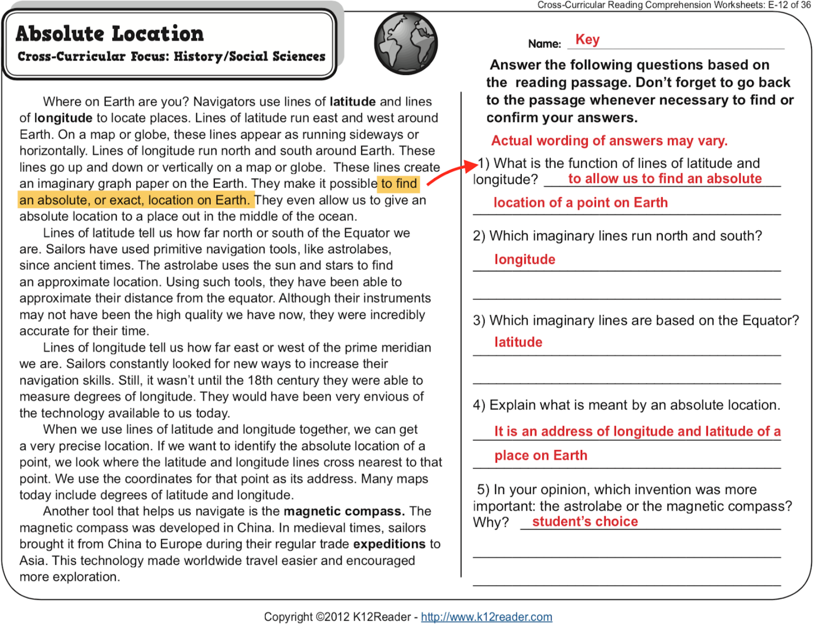

# SQuAD: The Stanford Question Answering Dataset 斯坦福阅读理解竞赛

[](https://github.com/PaddlePaddle/models)
[](LICENSE)

### 模型简介

阅读理解(Machine Reading Comprehension)被誉为人工智能皇冠上的明珠，是自然语言处理领域最具有挑战的任务之一。如下图所示，阅读理解任务可以被定义为：

给定若干篇章（一个或者多个）以及若干问题，机器需要在理解整个篇章的基础上，给出正确的答案，答案不限类型，可以是一个数字，一个实体名称，也可以是一个段落。



本项目包涵了使用PaddlePaddle实现基于[BERT](https://arxiv.org/abs/1810.04805)的SQuAD阅读理解模型，
包含模型训练，预测，评估，上线部署，以及使用自定义数据等内容。

## 内容速览
- [**安装**](#安装)
- [**快速开始**](#快速开始)
  - [准备数据](#准备数据)
  - [单机训练](#单机训练)
  - [效果评估](#效果评估)
- [**自定义数据**](#自定义数据)
- [**模型原理**](#模型原理)
- [**模型部署**: 多硬件环境模型部署支持](#模型部署)
  - [产出用于部署的 inference model](#保存-inference-model)
  - [inference 接口调用示例](#inference-接口调用示例)

## 安装

### 安装PaddlePaddle
本项目依赖于 Paddle Fluid >= **1.4.1**，请参考[安装指南](http://www.paddlepaddle.org/#quick-start)进行安装。

### 安装PALM
除此以外，需要安装PaddlePaddle针对自然语言处理开发的高级API：PALM，您可以在models/PaddleNLP下找到setup.py文件，通过

```python
python setup.py install
```

安装，或者通过pip：

```shell
pip install pd-palm
```
进行安装。PALM针对NLP场景提供了一套高级API，方便用户进行快速开发，关于PALM详见：(http://www.paddlepaddle.org/)

### 下载预训练模型
使用本项目需要下载BERT的预训练模型，用户可以通过PaddlePaddle的自然语言预训练工具箱[**LARK**](https://github.com/PaddlePaddle/LARK/tree/develop/BERT)获取丰富的预训练模型进行模型开发和优化，
本项目默认使用LARK下的[Cased BERT-Large](https://bert-models.bj.bcebos.com/cased_L-24_H-1024_A-16.tar.gz)模型。请下载并存放到./data/pretrain_models目录下。

每个预训练模型包括3部分：1. 词表vocab.txt，2. 模型配置（bert_config.json）3. 预训练参数。


### 其他
如果需要进行 TensorFlow 模型到 Paddle Fluid 参数的转换，则需要同时安装 TensorFlow 1.12。

## 快速开始

### 准备数据

本项目内预置了SQuAD1.1的训练集和开发集（./data/input/下），用无需下载。如需使用其他数据，请参考[使用自定义数据](#自定义数据)章节。

### 单机训练

本项目默认支持GPU单机 单卡/多卡，和CPU多核训练。在使用GPU训练时可以使用以下命令：

```shell
source ~/.bash_profile

# open garbage collection to save memory
export FLAGS_eager_delete_tensor_gb=0.0

# setting visible devices for training
export CUDA_VISIBLE_DEVICES=0,1,2,3

# training
python -u main.py \
  --do_train=True \
  --epoch=2 \
  --learning_rate=3e-5 \
  --weight_decay=0.001 \
  --use_cuda=True \
  --init_from_pretrain_model="./data/pretrain_models/bert_large_cased/params/" \
  --save_model_path="./data/saved_models/" \
  --save_checkpoint="checkpoints" \
  --save_param="params" \
  --training_file="./data/input/train-v1.1.json" \
  --bert_config_path="./data/pretrain_models/bert_large_cased/bert_config.json" \
  --vocab_path="./data/pretrain_models/bert_large_cased/vocab.txt" \
  --max_seq_len=384
```

如果需要使用GPU单卡，则只需要改变CUDA_VISIBLE_DEVICES=具体设备即可。如果需要使用CPU多核进行训练则需要使用以下命令：
```shell
source ~/.bash_profile

# open garbage collection to save memory
export FLAGS_eager_delete_tensor_gb=0.0

# setting visible devices for training
export CUDA_VISIBLE_DEVICES=""

# training
python -u main.py \
  --do_train=True \
  --epoch=2 \
  --learning_rate=3e-5 \
  --weight_decay=0.001 \
  --use_cuda=False \
  --init_from_pretrain_model="./data/pretrain_models/bert_large_cased/params/" \
  --save_model_path="./data/saved_models/" \
  --save_checkpoint="checkpoints" \
  --save_param="params" \
  --training_file="./data/input/train-v1.1.json" \
  --bert_config_path="./data/pretrain_models/bert_large_cased/bert_config.json" \
  --vocab_path="./data/pretrain_models/bert_large_cased/vocab.txt" \
  --max_seq_len=384
```

### 效果评估

在完成训练后，可以通过以下命令进行评估：

```shell
source ~/.bash_profile

export CUDA_VISIBLE_DEVICES=0

python -u main.py \
  --do_predict=True \
  --use_cuda=True \
  --init_from_params="./data/saved_models/params/step_final/" \
  --bert_config_path="./data/pretrain_models/bert_large_cased/bert_config.json" \
  --vocab_path="./data/pretrain_models/bert_large_cased/vocab.txt" \
  --output_prediction_file="./data/output/predictions.json" \
  --output_nbest_file="./data/output/nbest_predictions.json" \
  --prediciton_dir="./data/output/" \
  --predict_file="./data/input/dev-v1.1.json" \
  --max_seq_len=384
```
在这个命令里，我们使用init_from_params指定需要用哪个训练好的模型进行评估，并通过output_prediction_file和output_nbest_file指定保存文件的目录，在完成评估后，在./data/output/下回分别产生2个文件，对应1-best prediciton和 n-best prediction。根据这两个预测结果，我们就可以评估模型效果了：

```shell
export CUDA_VISIBLE_DEVICES=""

python -u main.py \
  --do_eval=True \
  --evaluation_file="./data/input/dev-v1.1.json" \
  --output_prediction_file="./data/output/predictions.json"

```

## 自定义数据 

在使用过程中，如果需要使用自定义数据，可以参照./data/input/train-v1.1.json和./data/input/dev-v1.1.json的格式重组自定义数据，这两个文件的格式样例如下：

```json

{
  u'paragraphs': [
    {
      u'qas': [
        {
          u'question': u'Which NFL team represented the AFC at Super Bowl 50?',
          u'id': u'56be4db0acb8001400a502ec',
          u'answers': [
            {
              u'text': u'Denver Broncos',
              u'answer_start': 177
            },
            {
              u'text': u'Denver Broncos',
              u'answer_start': 177
            },
            {
              u'text': u'Denver Broncos',
              u'answer_start': 177
            }
          ]
        },
        {
          u'question': u'Which NFL team represented the NFC at Super Bowl 50?',
          u'id': u'56be4db0acb8001400a502ed',
          u'answers': [
            {
              u'text': u'Carolina Panthers',
              u'answer_start': 249
            },
            {
              u'text': u'Carolina Panthers',
              u'answer_start': 249
            },
            {
              u'text': u'Carolina Panthers',
              u'answer_start': 249
            }
          ]
        },
        {
          u'question': u'Where did Super Bowl 50 take place?',
          u'id': u'56be4db0acb8001400a502ee',
          u'answers': [
            {
              u'text': u'Santa Clara, California',
              u'answer_start': 403
            },
            {
              u'text': u"Levi's Stadium",
              u'answer_start': 355
            },
            {
              u'text': u"Levi's Stadium in the San Francisco Bay Area at Santa Clara, California.",
              u'answer_start': 355
            }
          ]
        },
        {
          u'question': u'Which NFL team won Super Bowl 50?',
          u'id': u'56be4db0acb8001400a502ef',
          u'answers': [
            {
              u'text': u'Denver Broncos',
              u'answer_start': 177
            },
            {
              u'text': u'Denver Broncos',
              u'answer_start': 177
            },
            {
              u'text': u'Denver Broncos',
              u'answer_start': 177
            }
          ]
        },
        {
          u'question': u'What color was used to emphasize the 50th anniversary of the Super Bowl?',
          u'id': u'56be4db0acb8001400a502f0',
          u'answers': [
            {
              u'text': u'gold',
              u'answer_start': 488
            },
            {
              u'text': u'gold',
              u'answer_start': 488
            },
            {
              u'text': u'gold',
              u'answer_start': 521
            }
          ]
        },
        {
          u'question': u'What was the theme of Super Bowl 50?',
          u'id': u'56be8e613aeaaa14008c90d1',
          u'answers': [
            {
              u'text': u'"golden anniversary"',
              u'answer_start': 487
            },
            {
              u'text': u'gold-themed',
              u'answer_start': 521
            },
            {
              u'text': u'"golden anniversary',
              u'answer_start': 487
            }
          ]
        },
        {
          u'question': u'What day was the game played on?',
          u'id': u'56be8e613aeaaa14008c90d2',
          u'answers': [
            {
              u'text': u'February 7, 2016',
              u'answer_start': 334
            },
            {
              u'text': u'February 7',
              u'answer_start': 334
            },
            {
              u'text': u'February 7, 2016',
              u'answer_start': 334
            }
          ]
        },
        {
          u'question': u'What is the AFC short for?',
          u'id': u'56be8e613aeaaa14008c90d3',
          u'answers': [
            {
              u'text': u'American Football Conference',
              u'answer_start': 133
            },
            {
              u'text': u'American Football Conference',
              u'answer_start': 133
            },
            {
              u'text': u'American Football Conference',
              u'answer_start': 133
            }
          ]
        },
        {
          u'question': u'What was the theme of Super Bowl 50?',
          u'id': u'56bea9923aeaaa14008c91b9',
          u'answers': [
            {
              u'text': u'"golden anniversary"',
              u'answer_start': 487
            },
            {
              u'text': u'gold-themed',
              u'answer_start': 521
            },
            {
              u'text': u'gold',
              u'answer_start': 521
            }
          ]
        },
        {
          u'question': u'What does AFC stand for?',
          u'id': u'56bea9923aeaaa14008c91ba',
          u'answers': [
            {
              u'text': u'American Football Conference',
              u'answer_start': 133
            },
            {
              u'text': u'American Football Conference',
              u'answer_start': 133
            },
            {
              u'text': u'American Football Conference',
              u'answer_start': 133
            }
          ]
        },
        {
          u'question': u'What day was the Super Bowl played on?',
          u'id': u'56bea9923aeaaa14008c91bb',
          u'answers': [
            {
              u'text': u'February 7, 2016',
              u'answer_start': 334
            },
            {
              u'text': u'February 7',
              u'answer_start': 334
            },
            {
              u'text': u'February 7, 2016',
              u'answer_start': 334
            }
          ]
        },
        {
          u'question': u'Who won Super Bowl 50?',
          u'id': u'56beace93aeaaa14008c91df',
          u'answers': [
            {
              u'text': u'Denver Broncos',
              u'answer_start': 177
            },
            {
              u'text': u'Denver Broncos',
              u'answer_start': 177
            },
            {
              u'text': u'Denver Broncos',
              u'answer_start': 177
            }
          ]
        },
        {
          u'question': u'What venue did Super Bowl 50 take place in?',
          u'id': u'56beace93aeaaa14008c91e0',
          u'answers': [
            {
              u'text': u"Levi's Stadium",
              u'answer_start': 355
            },
            {
              u'text': u"Levi's Stadium",
              u'answer_start': 355
            },
            {
              u'text': u"Levi's Stadium in the San Francisco Bay Area at Santa Clara",
              u'answer_start': 355
            }
          ]
        },
        {
          u'question': u'What city did Super Bowl 50 take place in?',
          u'id': u'56beace93aeaaa14008c91e1',
          u'answers': [
            {
              u'text': u'Santa Clara',
              u'answer_start': 403
            },
            {
              u'text': u'Santa Clara',
              u'answer_start': 403
            },
            {
              u'text': u'Santa Clara',
              u'answer_start': 403
            }
          ]
        },
        {
          u'question': u'If Roman numerals were used, what would Super Bowl 50 have been called?',
          u'id': u'56beace93aeaaa14008c91e2',
          u'answers': [
            {
              u'text': u'Super Bowl L',
              u'answer_start': 693
            },
            {
              u'text': u'L',
              u'answer_start': 704
            },
            {
              u'text': u'Super Bowl L',
              u'answer_start': 693
            }
          ]
        },
        {
          u'question': u'Super Bowl 50 decided the NFL champion for what season?',
          u'id': u'56beace93aeaaa14008c91e3',
          u'answers': [
            {
              u'text': u'2015',
              u'answer_start': 116
            },
            {
              u'text': u'the 2015 season',
              u'answer_start': 112
            },
            {
              u'text': u'2015',
              u'answer_start': 116
            }
          ]
        },
        {
          u'question': u'What year did the Denver Broncos secure a Super Bowl title for the third time?',
          u'id': u'56bf10f43aeaaa14008c94fd',
          u'answers': [
            {
              u'text': u'2015',
              u'answer_start': 116
            },
            {
              u'text': u'2016',
              u'answer_start': 346
            },
            {
              u'text': u'2015',
              u'answer_start': 116
            }
          ]
        },
        {
          u'question': u'What city did Super Bowl 50 take place in?',
          u'id': u'56bf10f43aeaaa14008c94fe',
          u'answers': [
            {
              u'text': u'Santa Clara',
              u'answer_start': 403
            },
            {
              u'text': u'Santa Clara',
              u'answer_start': 403
            },
            {
              u'text': u'Santa Clara',
              u'answer_start': 403
            }
          ]
        },
        {
          u'question': u'What stadium did Super Bowl 50 take place in?',
          u'id': u'56bf10f43aeaaa14008c94ff',
          u'answers': [
            {
              u'text': u"Levi's Stadium",
              u'answer_start': 355
            },
            {
              u'text': u"Levi's Stadium",
              u'answer_start': 355
            },
            {
              u'text': u"Levi's Stadium",
              u'answer_start': 355
            }
          ]
        },
        {
          u'question': u'What was the final score of Super Bowl 50? ',
          u'id': u'56bf10f43aeaaa14008c9500',
          u'answers': [
            {
              u'text': u'24\u201310',
              u'answer_start': 267
            },
            {
              u'text': u'24\u201310',
              u'answer_start': 267
            },
            {
              u'text': u'24\u201310',
              u'answer_start': 267
            }
          ]
        },
        {
          u'question': u'What month, day and year did Super Bowl 50 take place? ',
          u'id': u'56bf10f43aeaaa14008c9501',
          u'answers': [
            {
              u'text': u'February 7, 2016',
              u'answer_start': 334
            },
            {
              u'text': u'February 7, 2016',
              u'answer_start': 334
            },
            {
              u'text': u'February 7, 2016',
              u'answer_start': 334
            }
          ]
        },
        {
          u'question': u'What year was Super Bowl 50?',
          u'id': u'56d20362e7d4791d009025e8',
          u'answers': [
            {
              u'text': u'2015',
              u'answer_start': 116
            },
            {
              u'text': u'2016',
              u'answer_start': 346
            },
            {
              u'text': u'2016',
              u'answer_start': 346
            }
          ]
        },
        {
          u'question': u'What team was the AFC champion?',
          u'id': u'56d20362e7d4791d009025e9',
          u'answers': [
            {
              u'text': u'Denver Broncos',
              u'answer_start': 177
            },
            {
              u'text': u'Denver Broncos',
              u'answer_start': 177
            },
            {
              u'text': u'Denver Broncos',
              u'answer_start': 177
            }
          ]
        },
        {
          u'question': u'What team was the NFC champion?',
          u'id': u'56d20362e7d4791d009025ea',
          u'answers': [
            {
              u'text': u'Carolina Panthers',
              u'answer_start': 249
            },
            {
              u'text': u'Carolina Panthers',
              u'answer_start': 249
            },
            {
              u'text': u'Carolina Panthers',
              u'answer_start': 249
            }
          ]
        },
        {
          u'question': u'Who won Super Bowl 50?',
          u'id': u'56d20362e7d4791d009025eb',
          u'answers': [
            {
              u'text': u'Denver Broncos',
              u'answer_start': 177
            },
            {
              u'text': u'Denver Broncos',
              u'answer_start': 177
            },
            {
              u'text': u'Denver Broncos',
              u'answer_start': 177
            }
          ]
        },
        {
          u'question': u'Super Bowl 50 determined the NFL champion for what season?',
          u'id': u'56d600e31c85041400946eae',
          u'answers': [
            {
              u'text': u'2015',
              u'answer_start': 116
            },
            {
              u'text': u'the 2015 season',
              u'answer_start': 112
            },
            {
              u'text': u'2015',
              u'answer_start': 116
            }
          ]
        },
        {
          u'question': u'Which team won Super Bowl 50.',
          u'id': u'56d600e31c85041400946eb0',
          u'answers': [
            {
              u'text': u'Denver Broncos',
              u'answer_start': 177
            },
            {
              u'text': u'Denver Broncos',
              u'answer_start': 177
            },
            {
              u'text': u'Denver Broncos',
              u'answer_start': 177
            }
          ]
        },
        {
          u'question': u'Where was Super Bowl 50 held?',
          u'id': u'56d600e31c85041400946eb1',
          u'answers': [
            {
              u'text': u'Santa Clara, California.',
              u'answer_start': 403
            },
            {
              u'text': u"Levi's Stadium",
              u'answer_start': 355
            },
            {
              u'text': u"Levi's Stadium",
              u'answer_start': 355
            }
          ]
        },
        {
          u'question': u'The name of the NFL championship game is?',
          u'id': u'56d9895ddc89441400fdb50e',
          u'answers': [
            {
              u'text': u'Super Bowl',
              u'answer_start': 0
            },
            {
              u'text': u'Super Bowl',
              u'answer_start': 0
            },
            {
              u'text': u'Super Bowl',
              u'answer_start': 0
            }
          ]
        },
        {
          u'question': u'What 2015 NFL team one the AFC playoff?',
          u'id': u'56d9895ddc89441400fdb510',
          u'answers': [
            {
              u'text': u'Denver Broncos',
              u'answer_start': 177
            },
            {
              u'text': u'Denver Broncos',
              u'answer_start': 177
            },
            {
              u'text': u'Denver Broncos',
              u'answer_start': 177
            }
          ]
        }
      ],
      u'context': u'Super Bowl 50 was an American football game to determine the champion of the National Football League (NFL) for the 2015 season. The American Football Conference (AFC) champion Denver Broncos defeated the National Football Conference (NFC) champion Carolina Panthers 24\u201310 to earn their third Super Bowl title. The game was played on February 7, 2016, at Levi\'s Stadium in the San Francisco Bay Area at Santa Clara, California. As this was the 50th Super Bowl, the league emphasized the "golden anniversary" with various gold-themed initiatives, as well as temporarily suspending the tradition of naming each Super Bowl game with Roman numerals (under which the game would have been known as "Super Bowl L"), so that the logo could prominently feature the Arabic numerals 50.'
    },
    
    ...
    
    {
      u'qas': [
        {
          u'question': u'How many total yards did Denver gain?',
          u'id': u'56becb823aeaaa14008c948b',
          u'answers': [
            {
              u'text': u'194',
              u'answer_start': 136
            },
            {
              u'text': u'194',
              u'answer_start': 136
            },
            {
              u'text': u'194',
              u'answer_start': 136
            }
          ]
        },
        {
          u'question': u'How many first downs did Denver have?',
          u'id': u'56becb823aeaaa14008c948c',
          u'answers': [
            {
              u'text': u'11',
              u'answer_start': 164
            },
            {
              u'text': u'11',
              u'answer_start': 164
            },
            {
              u'text': u'11',
              u'answer_start': 164
            }
          ]
        },
        {
          u'question': u'What team had 244 yards in Super Bowl XXXV?',
          u'id': u'56becb823aeaaa14008c948d',
          u'answers': [
            {
              u'text': u'Baltimore Ravens',
              u'answer_start': 308
            },
            {
              u'text': u'the Baltimore Ravens',
              u'answer_start': 304
            },
            {
              u'text': u'Ravens',
              u'answer_start': 318
            }
          ]
        },
        {
          u'question': u'Who returned a punt for 61 yards, setting a new Super Bowl record?',
          u'id': u'56becb823aeaaa14008c948e',
          u'answers': [
            {
              u'text': u'Jordan Norwood',
              u'answer_start': 593
            },
            {
              u'text': u'Jordan Norwood',
              u'answer_start': 593
            },
            {
              u'text': u'Norwood',
              u'answer_start': 600
            }
          ]
        },
        {
          u'question': u'Who is the only quarterback to win a Super Bowl with two teams?',
          u'id': u'56becb823aeaaa14008c948f',
          u'answers': [
            {
              u'text': u'Manning',
              u'answer_start': 897
            },
            {
              u'text': u'Manning',
              u'answer_start': 1069
            },
            {
              u'text': u'Manning',
              u'answer_start': 1069
            }
          ]
        },
        {
          u'question': u'How many yards did Denver have for Super Bowl 50?',
          u'id': u'56d7277c0d65d214001983fe',
          u'answers': [
            {
              u'text': u'194',
              u'answer_start': 136
            },
            {
              u'text': u'194',
              u'answer_start': 136
            },
            {
              u'text': u'194',
              u'answer_start': 136
            }
          ]
        },
        {
          u'question': u'How many first downs did Denver have for Super Bowl 50?',
          u'id': u'56d7277c0d65d214001983ff',
          u'answers': [
            {
              u'text': u'11',
              u'answer_start': 164
            },
            {
              u'text': u'11',
              u'answer_start': 164
            },
            {
              u'text': u'11',
              u'answer_start': 164
            }
          ]
        },
        {
          u'question': u'Who did the Broncos tie with the most sacks in a Super Bowl?',
          u'id': u'56d7277c0d65d21400198401',
          u'answers': [
            {
              u'text': u'Chicago Bears',
              u'answer_start': 508
            },
            {
              u'text': u'the Chicago Bears',
              u'answer_start': 504
            },
            {
              u'text': u'Bears',
              u'answer_start': 516
            }
          ]
        },
        {
          u'question': u'Which team did Gary Kubiak play for when he was in the Super Bowl?',
          u'id': u'56d7277c0d65d21400198402',
          u'answers': [
            {
              u'text': u'Broncos',
              u'answer_start': 451
            },
            {
              u'text': u'Denver',
              u'answer_start': 726
            },
            {
              u'text': u'Denver',
              u'answer_start': 68
            }
          ]
        },
        {
          u'question': u'How many first downs did the Panthers have in Super Bowl 50?',
          u'id': u'56d9cd9adc89441400fdb84c',
          u'answers': [
            {
              u'text': u'21',
              u'answer_start': 158
            },
            {
              u'text': u'21',
              u'answer_start': 158
            },
            {
              u'text': u'21',
              u'answer_start': 158
            }
          ]
        },
        {
          u'question': u'How many first downs did the Broncos have in Super Bowl 50?',
          u'id': u'56d9cd9adc89441400fdb84d',
          u'answers': [
            {
              u'text': u'11',
              u'answer_start': 164
            },
            {
              u'text': u'11',
              u'answer_start': 164
            },
            {
              u'text': u'11',
              u'answer_start': 164
            }
          ]
        },
        {
          u'question': u'What team had the lowest downs and yards ever in the Super Bowl as of Super Bowl 50?',
          u'id': u'56d9cd9adc89441400fdb84e',
          u'answers': [
            {
              u'text': u'The Broncos',
              u'answer_start': 447
            },
            {
              u'text': u'Denver',
              u'answer_start': 68
            },
            {
              u'text': u'Denver',
              u'answer_start': 68
            }
          ]
        },
        {
          u'question': u'What team di the Broncos tie a Super Bowl record for in sacks?',
          u'id': u'56d9cd9adc89441400fdb84f',
          u'answers': [
            {
              u'text': u'Chicago Bears',
              u'answer_start': 508
            },
            {
              u'text': u'the Chicago Bears',
              u'answer_start': 504
            },
            {
              u'text': u'Bears',
              u'answer_start': 516
            }
          ]
        },
        {
          u'question': u'How many teams has Manning won the Super Bowl with?',
          u'id': u'56d9cd9adc89441400fdb850',
          u'answers': [
            {
              u'text': u'two',
              u'answer_start': 814
            },
            {
              u'text': u'two',
              u'answer_start': 1199
            },
            {
              u'text': u'two',
              u'answer_start': 1199
            }
          ]
        }
      ],
      u'context': u"Super Bowl 50 featured numerous records from individuals and teams. Denver won despite being massively outgained in total yards (315 to 194) and first downs (21 to 11). Their 194 yards and 11 first downs were both the lowest totals ever by a Super Bowl winning team. The previous record was 244 yards by the Baltimore Ravens in Super Bowl XXXV. Only seven other teams had ever gained less than 200 yards in a Super Bowl, and all of them had lost. The Broncos' seven sacks tied a Super Bowl record set by the Chicago Bears in Super Bowl XX. Kony Ealy tied a Super Bowl record with three sacks. Jordan Norwood's 61-yard punt return set a new record, surpassing the old record of 45 yards set by John Taylor in Super Bowl XXIII. Denver was just 1-of-14 on third down, while Carolina was barely better at 3-of-15. The two teams' combined third down conversion percentage of 13.8 was a Super Bowl low. Manning and Newton had quarterback passer ratings of 56.6 and 55.4, respectively, and their added total of 112 is a record lowest aggregate passer rating for a Super Bowl. Manning became the oldest quarterback ever to win a Super Bowl at age 39, and the first quarterback ever to win a Super Bowl with two different teams, while Gary Kubiak became the first head coach to win a Super Bowl with the same franchise he went to the Super Bowl with as a player."
    }
  ],
  u'title': u'Super_Bowl_50'
}

```
其中，paragraphs中存储了多个context-question-answer的数据对儿，每个context表示了一段话，question是针对这段话的提问，answer存储了具体的答案，以及答案的位置信息。您可以根据上述格式对自己的数据进行组织。

## 模型原理

本项目使用BERT完成阅读理解任务，您可以参考文章：[BERT: Pre-training of Deep Bidirectional Transformers for Language Understanding
](https://arxiv.org/abs/1810.04805)，了解详细内容。


## 模型部署

深度学习模型需要应用于实际情景，则需要进行模型的部署，把训练好的模型部署到不同的机器上去，这需要考虑不同的硬件环境，包括 GPU/CPU 的环境，单机/分布式集群，或者嵌入式设备；同时还要考虑软件环境，比如部署的机器上是否都安装了对应的深度学习框架；还要考虑运行性能等。但是要求部署环境都安装整个框架会给部署带来不便，为了解决深度学习模型的部署，一种可行的方案是使得模型可以脱离框架运行，Paddle Fluid 采用这种方法进行部署，编译 [Paddle Fluid inference](http://paddlepaddle.org/documentation/docs/zh/1.2/advanced_usage/deploy/inference/build_and_install_lib_cn.html) 库，并且编写加载模型的 `C++` inference 接口。预测的时候则只要加载保存的预测网络结构和模型参数，就可以对输入数据进行预测，不再需要整个框架而只需要 Paddle Fluid inference 库，这带来了模型部署的灵活性。

以语句和语句对分类任务为例子，下面讲述如何进行模型部署。首先需要进行模型的训练，其次是要保存用于部署的模型。最后编写 `C++` inference 程序加载模型和参数进行预测。

前面 [语句和句对分类任务](#语句和句对分类任务) 一节中讲到了如何训练 XNLI 任务的模型，并且保存了 checkpoints。但是值得注意的是这些 checkpoint 中只是包含了模型参数以及对于训练过程中必要的状态信息（参见 [params](http://paddlepaddle.org/documentation/docs/zh/1.3/api_cn/io_cn.html#save-params) 和 [persistables](http://paddlepaddle.org/documentation/docs/zh/1.3/api_cn/io_cn.html#save-persistables) ), 现在要生成预测用的 [inference model](http://paddlepaddle.org/documentation/docs/zh/1.2/api_cn/io_cn.html#permalink-5-save_inference_model)，可以按照下面的步骤进行。

### 保存 inference model

```shell
BERT_BASE_PATH="chinese_L-12_H-768_A-12"
TASK_NAME="XNLI"
DATA_PATH=/path/to/xnli/data/
INIT_CKPT_PATH=/path/to/a/finetuned/checkpoint/

python -u predict_classifier.py --task_name ${TASK_NAME} \
       --use_cuda true \
       --batch_size 64 \
       --data_dir ${DATA_PATH} \
       --vocab_path ${BERT_BASE_PATH}/vocab.txt \
       --init_checkpoint ${INIT_CKPT_PATH} \
       --do_lower_case true \
       --max_seq_len 128 \
       --bert_config_path ${BERT_BASE_PATH}/bert_config.json \
       --do_predict true \
       --save_inference_model_path ${INIT_CKPT_PATH}
```

以上的脚本完成可以两部分工作：

1. 从某一个 `init_checkpoint` 加载模型参数，此时如果设定参数 `--do_predict` 为 `true` 则在 `test` 数据集上进行测试，输出预测结果。
2. 生成对应于 `init_checkpoint` 的 inference model，这会被保存在 `${INIT_CKPT_PATH}/{CKPT_NAME}_inference_model` 目录。

### inference 接口调用示例

使用 `C++` 进行预测的过程需要使用 Paddle Fluid inference 库，具体的使用例子参考 [`inference`](./inference) 目录下的 `README.md`.

下面的代码演示了如何使用 `C++` 进行预测，更多细节请见 [`inference`](./inference) 目录下的例子，可以参考例子写 inference。

``` cpp
#include <paddle_inference_api.h>

// create and set configuration
paddle::NativeConfig config;
config.model_dir = "xxx";
config.use_gpu = false;

// create predictor
auto predictor = CreatePaddlePredictor(config);

// create input tensors
paddle::PaddleTensor src_id;
src.dtype = paddle::PaddleDType::INT64;
src.shape = ...;
src.data.Reset(...);

paddle::PaddleTensor pos_id;
paddle::PaddleTensor segmeng_id;
paddle::PaddleTensor input_mask;

// create iutput tensors and run prediction
std::vector<paddle::PaddleTensor> output;
predictor->Run({src_id, pos_id, segmeng_id, input_mask}, &output);

// XNLI task for example
std::cout << "example_id\tcontradiction\tentailment\tneutral";
for (size_t i = 0; i < output.front().data.length() / sizeof(float); i += 3) {
  std::cout << static_cast<float *>(output.front().data.data())[i] << "\t"
            << static_cast<float *>(output.front().data.data())[i + 1] << "\t"
            << static_cast<float *>(output.front().data.data())[i + 2] << std::endl;
}
```
