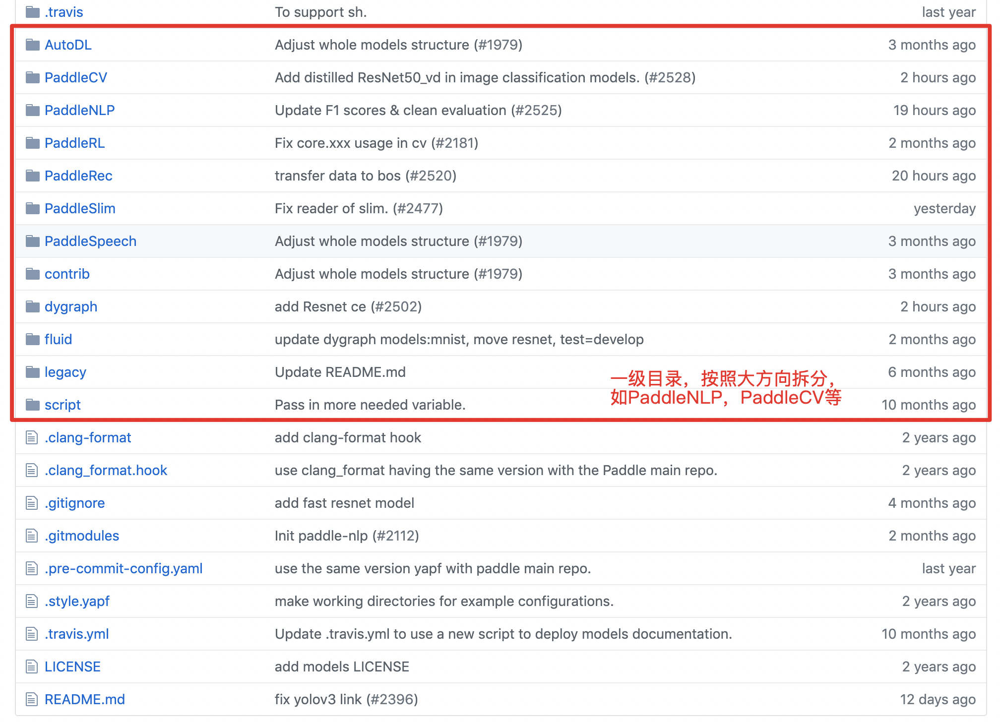
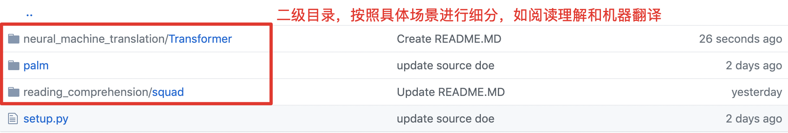
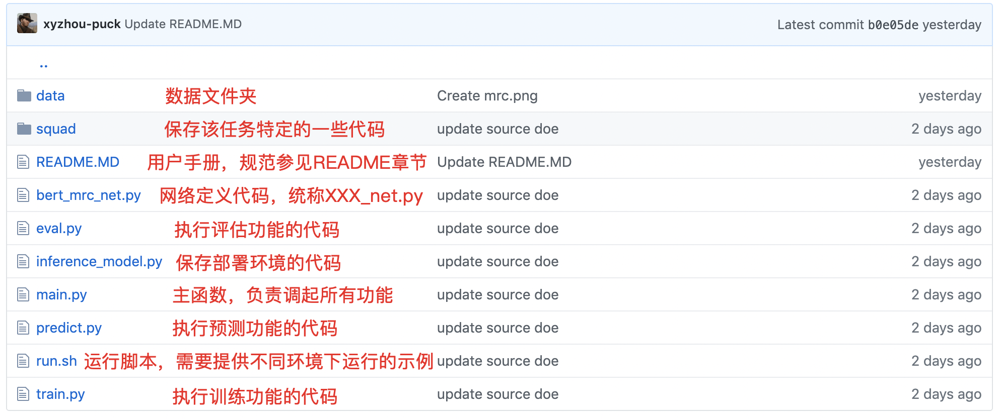

# Paddle官方模型库开发规范

[](https://github.com/PaddlePaddle/models)
[](LICENSE)

## 目录
- [**整体目标和原则**](#整体目标和原则)

- [**必选规范**](#必选规范)

  - [**目录结构**](#目录结构)
  
  - [**功能实现**](#功能实现)
  
  - [**书写示例**](#书写示例)
  
  -[**重点关注事项**](#整体需要注意的问题)
  
  - [**命名规范**](#命名规范和使用规范)
  
  - [**README**](#README)
  
  - [**多环境支持**](#多环境支持)
  
  - [**注释和Licenses**](#注释和Licenses)

- [**建议规范**](#建议规范)

  - [**显存优化**](#显存优化)
  
  
  
- [**合入规则**](#合入规则)
  
  - [**代码提交**](#代码提交)
  
  - [**code_review**](#code_review)

- [**升级维护**](#升级维护)

## 整体目标和原则

### 整体目标
为PaddlePaddle/models用户，提供功能一致，风格统一，可插拔的NLP，CV，Speech等领域的重要模型。
提高PaddlePaddle用户的开发效率。
加速部分老旧有bug的API离场，并推进新API的快速落地。

### 原则
1. 不同领域在逻辑上统一功能，在具体落实上（如configure的使用方式），尊重并拥抱各个领域的主流做法。但在具体大方向上，不可进一步拆分，需形成统一。
2. 区分规范为必选和可选，原则上要求所有模型遵守必选规范，建议遵守可选规范。
3. 原则上要求模型可以在**GPU单卡多卡**，**CPU多核**上执行**训练**，**预测**，**评估**和**准备部署环境**，并可以支持轻松**使用自定义数据**。
4. 如果有特殊情况，需要在readme中的显眼位置做出说明，避免用户踩坑。

## 必选规范

### 目录结构

遵照1.5 Paddle-models结构，将整体模型库拆分为3级目录结构，如下图所示：

#### 一级目录，按照大方向进行细分，如PaddleNLP，PaddleCV等：



#### 二级目录



1. 原则上按照具体场景进行拆分，如在PaddleNLP下，有neural_machine_translation，reading_comprehension等。
2. 共享网络、预处理、Research部分都作为二级目录，如在PaddleNLP下，有models，preprocess，Research等。

#### 叶子目录

- 具体到某个具体的任务，如SQuAD，则建议包涵以下内容：



- **data**：存储所有跟数据相关的内容，如configure，dict，input，output，saved_models，inferenece_models等。
- **squad**：该文件夹命名可以根据具体任务进行命名，保存该任务下一些特定的代码，如reader.py，batching.py，tokenizer.py等。
- **README.MD**: 当前任务库的使用手册，规范参见[**使用手册规范**](#README)
- **XXX_net.py**: 保存网络定义的脚本，可以有多个XXX_net.py，不同net之间在网络声明阶段需要统一output，也需要尽量统一input。
- **eval.py**：执行评估的脚本。
- **inference_model.py**：执行保存inference_model的脚本，用于准备上线部署环境。
- **main.py**：主程序入口，通过命令行或者configure文件，执行不同逻辑。
- **predict.py**：执行预测功能的脚本，需要可以单独运行。
- **train.py**：执行训练功能的脚本，需要可以单独运行。
- **run.sh**：示例脚本，需要给出不同环境下（GPU单卡多卡，CPU多核），如何进行训练，预测，评估，保存部署环境等功能。
- **run_XXX.py**:也可以将eval.py/train.py/predict.py合并成一个文件, 不同的训练策略用不用的XXX区分。

### 功能实现

原则上需要官方提供的模型需要提供：
1. **训练**：可以在GPU单卡/多卡，CPU多核的环境下执行训练，至少有一个环境可以打平竞品效果或者复现原有paper效果（如果存在竞品），官方可以给出一种推荐训练的方式。
2. **预测**：可以在GPU单卡和CPU单核下执行预测。
3. **评估**：要求同预测。
4. **保存部署环境**：可以保存可以部署环境，支持模型部署。
5. **使用自定义数据**：要求官方模型可以灵活支持/适配用户自定义数据，可以通过在readme中加入数据格式描部分和**如何使用自定义数据**章节解决。

#### 共享网络

1. 对于不同的应用场景采用相同网络的情况，可以用共享网络的方案来实现。
2. 以PaddleNLP为例，可以将文本分类、匹配、序列标注等典型任务的常用网络封装到models路径中，在应用中直接引用相关模块即可。
3. 采用直接使用sys.path.append(‘../’)，然后使用package全路径名，避免相对引用，例如引用nets.py，就变成from models.classify import nets
4. 不同网络作为nets.py中的一个函数进行封装。

#### 预处理

1. 对于NLP类应用需要诸如分词一样的文本预处理工作。这些模块统一封装在preprocess中。
2. 以PaddleNLP的分词为例，可以采用如下方式:
```shell
python ../preprocess/tokenizer/tokenizer.py --test_data_dir ./test.txt.utf8 --batch_size 1 > test.txt.utf8.seg
```

### 书写示例

下面以SQUAD下面的ERNIE-based MRC模型具体说明一些代码书写方面的问题。

#### net.py书写示例
```python
#encoding=utf8
# Copyright (c) 2019 PaddlePaddle Authors. All Rights Reserved
#
# Licensed under the Apache License, Version 2.0 (the "License");
# you may not use this file except in compliance with the License.
# You may obtain a copy of the License at
#
#     http://www.apache.org/licenses/LICENSE-2.0
#
# Unless required by applicable law or agreed to in writing, software
# distributed under the License is distributed on an "AS IS" BASIS,
# WITHOUT WARRANTIES OR CONDITIONS OF ANY KIND, either express or implied.
# See the License for the specific language governing permissions and
# limitations under the License.

import os
import sys
import numpy as np
import paddle
import paddle.fluid as fluid

def create_net(
  is_training, 
  model_input, 
  args):
  
    """
    create the network of BERT-based Machine Reading Comprehension Network.
    is_training: a boolean value, indicating if the model to be created is for training or predicting.
    model_input: stores the input of the model
      for simple task like mnist: model_input can be either a single/tuple/list of fluid.layers.data.
      for complicated task like ERNIE-based machine reading comprehension, the model_input is an object like:
      
      class model_input:
        def __inint__(self):
          self.image = fluid.layers.data(shape = [-1, 8, 8, 1], dtype = "int64", name = "image")
      

      you can define your own one in the code or you can use PALM for easy input data management.
      
    """

    # declare the model input here
    if is_training:
        src_ids = model_input.src_ids
        ...
        is_null_answer = model_input.is_null_answer
    else:
        src_ids = model_input.src_ids
        ...
        unique_id = model_input.unique_id

    # define the model bert first

    assert isinstance(args.bert_config_path, str)

    # define the model here
    bert_conf = JsonConfig(args.bert_config_path)
    base_model = BertModel(
        src_ids=src_ids,
        position_ids=pos_ids,
        sentence_ids=sent_ids,
        input_mask=input_mask,
        config=bert_conf)

    sequence_output = base_model.get_sequence_output()

    ...

    # if is_training, then return the loss, otherwise return the prediction

    if is_training:

        def compute_loss(logits, positions):
            loss = fluid.layers.softmax_with_cross_entropy(
                logits=logits, label=positions)
            loss = fluid.layers.mean(x=loss)
            return loss

        start_loss = compute_loss(start_logits, start_positions)
        end_logits = fluid.layers.reshape(
            x=end_logits,
            shape=[-1, args.start_top_k, list(end_logits.shape)[-1]])
        end_logits = fluid.layers.slice(
            end_logits, axes=[1], starts=[0], ends=[1])
        end_logits = fluid.layers.reshape(
            x=end_logits, shape=[-1, list(end_logits.shape)[-1]])
        end_loss = compute_loss(end_logits, end_positions)

        total_loss = (start_loss + end_loss) / 2.0

        if args.use_fp16 and args.loss_scaling > 1.0:
            total_loss = total_loss * args.loss_scaling

        return total_loss

    else:

        predict = [unique_id, top_k_start_log_probs, top_k_start_indexes, \
            top_k_end_log_probs, top_k_end_indexes]

        return predict

```

#### train.py书写示例

```python
#encoding=utf8
# Copyright (c) 2019 PaddlePaddle Authors. All Rights Reserved
#
# Licensed under the Apache License, Version 2.0 (the "License");
# you may not use this file except in compliance with the License.
# You may obtain a copy of the License at
#
#     http://www.apache.org/licenses/LICENSE-2.0
#
# Unless required by applicable law or agreed to in writing, software
# distributed under the License is distributed on an "AS IS" BASIS,
# WITHOUT WARRANTIES OR CONDITIONS OF ANY KIND, either express or implied.
# See the License for the specific language governing permissions and
# limitations under the License.


import os
import sys
import numpy as np
import argparse
import paddle
import paddle.fluid as fluid

#include palm for easier nlp coding
from palm.toolkit.input_field import InputField
from palm.toolkit.configure import PDConfig
from palm.algorithm.optimization import optimization

# include task-specific libs
from bert_mrc_net import create_net
from squad.reader import DataProcessor, write_predictions

# 读取预训练模型
def init_from_pretrain_model(args, exe, program):

    assert isinstance(args.init_from_pretrain_model, str)

    if not os.path.exists(args.init_from_pretrain_model):
        raise Warning("The pretrained params do not exist.")
        return False

    def existed_params(var):
        if not isinstance(var, fluid.framework.Parameter):
            return False
        return os.path.exists(
            os.path.join(args.init_from_pretrain_model, var.name))

    fluid.io.load_vars(
        exe,
        args.init_from_pretrain_model,
        main_program=program,
        predicate=existed_params)

    print("finish initing model from pretrained params from %s" %
          (args.init_from_pretrain_model))

    return True

# 读取一个checkpoint，进行恢复训练
def init_from_checkpoint(args, exe, program):

    assert isinstance(args.init_from_checkpoint, str)

    if not os.path.exists(args.init_from_checkpoint):
        raise Warning("the checkpoint path does not exist.")
        return False

    fluid.io.load_persistables(
        executor=exe,
        dirname=args.init_from_checkpoint,
        main_program=program,
        filename="checkpoint.pdckpt")

    print("finish initing model from checkpoint from %s" %
          (args.init_from_checkpoint))

    return True

# 保存一个checkpoint，用以后续继续训练
def save_checkpoint(args, exe, program, dirname):

    assert isinstance(args.save_model_path, str)

    checkpoint_dir = os.path.join(args.save_model_path, args.save_checkpoint)

    if not os.path.exists(checkpoint_dir):
        os.mkdir(checkpoint_dir)

    fluid.io.save_persistables(
        exe,
        os.path.join(checkpoint_dir, dirname),
        main_program=program,
        filename="checkpoint.pdparams")

    print("save checkpoint at %s" % (os.path.join(checkpoint_dir, dirname)))

    return True

# 保存模型的参数，用以后续预测部署等任务
def save_param(args, exe, program, dirname):

    assert isinstance(args.save_model_path, str)

    param_dir = os.path.join(args.save_model_path, args.save_param)

    if not os.path.exists(param_dir):
        os.mkdir(param_dir)

    fluid.io.save_params(
        exe,
        os.path.join(param_dir, dirname),
        main_program=program,
        filename="params.pdparams")
    print("save parameters at %s" % (os.path.join(param_dir, dirname)))

    return True

# 训练函数入口，args默认使用argparse
def do_train(args):

    train_prog = fluid.default_main_program()
    startup_prog = fluid.default_startup_program()

    with fluid.program_guard(train_prog, startup_prog):
        train_prog.random_seed = args.random_seed
        startup_prog.random_seed = args.random_seed

        with fluid.unique_name.guard():

            # define input and reader
            # 对于比较简单的任务可以直接写 input_data = fluid.layers.data()
            # 对于比较复杂的任务，建议自行封装到一个类里，或者使用PALM input_fiedl进行处理。

            input_slots = [{
                "name": "src_ids",
                "shape": (-1, args.max_seq_len, 1),
                "dtype": "int64"
            }, 
            ...
            {
                "name": "is_null_answer",
                "shape": (-1, 1),
                "dtype": "int64"
            }]

            input_field = InputField(input_slots)
            input_field.build(build_pyreader=True)

            # define the network
            # 调用 XXX_net.py 声明网络定义，如果有多个网络，可以通过args进行分支判断
            
            loss = create_net(
                is_training=True, model_input=input_field, args=args)
            
            # 如果使用了GC，则需要保留persistable的定义（for 1.5），1.6后移除
            loss.persistable = True

            # define the optimizer

            optimizor = optimization(
                loss=loss)

    # prepare training

    ## decorate the pyreader with batch_generator
    ## 定义和装配reader，reader统一采用PyReader（注意并非py_reader）
    input_field.reader.decorate_batch_generator(batch_generator)

    ## define the executor and program for training
    
    # 根据args.use_cuda定义模型的place
    # 后续如果框架支持自动适配place则不需加入
    
    if args.use_cuda:
        place = fluid.CUDAPlace(0)
    else:
        place = fluid.CPUPlace()

    exe = fluid.Executor(place)

    exe.run(startup_prog)

    assert (args.init_from_checkpoint == "") or (
        args.init_from_pretrain_model == "")

    ## init from some checkpoint, to resume the previous training
    if args.init_from_checkpoint:
        init_from_checkpoint(args, exe, train_prog)

    ## init from some pretrain models, to better solve the current task
    if args.init_from_pretrain_model:
        init_from_pretrain_model(args, exe, train_prog)

    # 统一通过 compile_program + with_data_parallel 开启GPU多卡和CPU多核训练
    # 注意这里要区分一下CPU和GPU运行环境的配置，建议对每个场景都尽量能达到最优配置，防止用户吐槽
    
    build_strategy = fluid.compiler.BuildStrategy()
    build_strategy.enable_inplace = True

    compiled_train_prog = fluid.CompiledProgram(train_prog).with_data_parallel(
        loss_name=loss.name, build_strategy=build_strategy)

    # start training

    step = 0
    for epoch_step in range(args.epoch):
        input_field.reader.start()
        while True:
            try:

                # this is for minimizing the fetching op, saving the training speed.
                if step % args.print_step == 0:
                    fetch_list = [loss.name]
                else:
                    fetch_list = []

                output = exe.run(compiled_train_prog, fetch_list=fetch_list)

                if step % args.print_step == 0:
                    print("step: %d, loss: %.4f" % (step, np.sum(output[0])))

                if step % args.save_step == 0 and step != 0:

                    if args.save_checkpoint:
                        save_checkpoint(args, exe, train_prog,
                                        "step_" + str(step))

                    if args.save_param:
                        save_param(args, exe, train_prog, "step_" + str(step))

                step += 1

            except fluid.core.EOFException:
                input_field.reader.reset()
                break

    if args.save_checkpoint:
        save_checkpoint(args, exe, train_prog, "step_final")

    if args.save_param:
        save_param(args, exe, train_prog, "step_final")


if __name__ == "__main__":
    # 参数控制可以根据需求使用argparse，yaml或者json
    # 对NLP任务推荐使用PALM下定义的configure，可以统一argparse，yaml或者json格式的配置文件。
    
    args = PDConfig(yaml_file="./data/config/squad1.yaml")
    args.build()
    args.Print()

    do_train(args)
    
```
predict.py 和 eval.py 的定义可以参考train.py进行。

#### main.py书写示例

```python
#encoding=utf8
# Copyright (c) 2019 PaddlePaddle Authors. All Rights Reserved
#
# Licensed under the Apache License, Version 2.0 (the "License");
# you may not use this file except in compliance with the License.
# You may obtain a copy of the License at
#
#     http://www.apache.org/licenses/LICENSE-2.0
#
# Unless required by applicable law or agreed to in writing, software
# distributed under the License is distributed on an "AS IS" BASIS,
# WITHOUT WARRANTIES OR CONDITIONS OF ANY KIND, either express or implied.
# See the License for the specific language governing permissions and
# limitations under the License.

import os
import sys
import numpy as np
import paddle
import paddle.fluid as fluid

#include palm for easier nlp coding
from palm.toolkit.configure import PDConfig

from train import do_train
from predict import do_predict
from eval import do_eval
from inference_model import do_save_inference_model

if __name__ == "__main__":

    # 可选，载入预定义参数
    args = PDConfig(yaml_file="./data/config/squad1.yaml")
    args.build()
    
    # 打印参数，帮助用户提早发现模型中的问题
    args.Print()

    if args.do_train:
        do_train(args)

    if args.do_predict:
        do_predict(args)

    if args.do_eval:
        do_eval(args)

    if args.do_save_inference_model:
        do_save_inference_model(args)


```

- 下面以sentiment_classification说明如何使用共享网络。

#### run_classifier.py书写实例
```python
"""
Sentiment Classification Task
"""

from __future__ import absolute_import
from __future__ import division
from __future__ import print_function

import os
import time
import argparse
import numpy as np
import multiprocessing
import sys
sys.path.append("../models/classification/")

from nets import bow_net
from nets import lstm_net
from nets import cnn_net
from nets import bilstm_net
from nets import gru_net

import paddle
import paddle.fluid as fluid

import reader
from config import SentaConfig
from utils import ArgumentGroup, print_arguments
from utils import init_checkpoint

# yapf: disable
parser = argparse.ArgumentParser(__doc__)
model_g = ArgumentGroup(parser, "model", "model configuration and paths.")
model_g.add_arg("senta_config_path", str, None, "Path to the json file for senta model config.")
model_g.add_arg("init_checkpoint", str, None, "Init checkpoint to resume training from.")
model_g.add_arg("checkpoints", str, "checkpoints", "Path to save checkpoints")

train_g = ArgumentGroup(parser, "training", "training options.")
train_g.add_arg("epoch", int, 10, "Number of epoches for training.")
train_g.add_arg("save_steps", int, 10000, "The steps interval to save checkpoints.")
train_g.add_arg("validation_steps", int, 1000, "The steps interval to evaluate model performance.")
train_g.add_arg("lr", float, 0.002, "The Learning rate value for training.")

log_g = ArgumentGroup(parser, "logging", "logging related")
log_g.add_arg("skip_steps", int, 10, "The steps interval to print loss.")
log_g.add_arg("verbose", bool, False, "Whether to output verbose log")

data_g = ArgumentGroup(parser, "data", "Data paths, vocab paths and data processing options")
data_g.add_arg("data_dir", str, None, "Path to training data.")
data_g.add_arg("vocab_path", str, None, "Vocabulary path.")
data_g.add_arg("batch_size", int, 256, "Total examples' number in batch for training.")
data_g.add_arg("random_seed", int, 0, "Random seed.")

run_type_g = ArgumentGroup(parser, "run_type", "running type options.")
run_type_g.add_arg("use_cuda", bool, True, "If set, use GPU for training.")
run_type_g.add_arg("task_name", str, None,
    "The name of task to perform sentiment classification.")
run_type_g.add_arg("do_train", bool, True, "Whether to perform training.")
run_type_g.add_arg("do_val", bool, True, "Whether to perform evaluation.")
run_type_g.add_arg("do_infer", bool, True, "Whether to perform inference.")

args = parser.parse_args()
# yapf: enable.

def create_model(args,
                 pyreader_name,
                 senta_config,
                 num_labels,
                 is_inference=False):

    """
    Create Model for sentiment classification
    """

    pyreader = fluid.layers.py_reader(
        capacity=16,
        shapes=([-1, 1], [-1, 1]),
        dtypes=('int64', 'int64'),
        lod_levels=(1, 0),
        name=pyreader_name,
        use_double_buffer=False)

    if senta_config['model_type'] == "bilstm_net":
        network = bilstm_net
    elif senta_config['model_type'] == "bow_net":
        network = bow_net
    elif senta_config['model_type'] == "cnn_net":
        network = cnn_net
    elif senta_config['model_type'] == "lstm_net":
        network = lstm_net
    elif senta_config['model_type'] == "gru_net":
        network = gru_net
    else:
        raise ValueError("Unknown network type!")

    if is_inference:
        data, label = fluid.layers.read_file(pyreader)
        probs = network(data, None, senta_config["vocab_size"], is_infer=is_inference)
        print("create inference model...")
        return pyreader, probs

    data, label = fluid.layers.read_file(pyreader)
    ce_loss, probs = network(data, label, senta_config["vocab_size"], is_infer=is_inference)
    loss = fluid.layers.mean(x=ce_loss)
    num_seqs = fluid.layers.create_tensor(dtype='int64')
    accuracy = fluid.layers.accuracy(input=probs, label=label, total=num_seqs)
    return pyreader, loss, accuracy, num_seqs


def evaluate(exe, test_program, test_pyreader, fetch_list, eval_phase):
    """
    Evaluation Function
    """
    test_pyreader.start()
    total_cost, total_acc, total_num_seqs = [], [], []
    time_begin = time.time()
    while True:
        try:
            np_loss, np_acc, np_num_seqs = exe.run(program=test_program,
                                                   fetch_list=fetch_list,
                                                   return_numpy=False)
            np_loss = np.array(np_loss)
            np_acc = np.array(np_acc)
            np_num_seqs = np.array(np_num_seqs)
            total_cost.extend(np_loss * np_num_seqs)
            total_acc.extend(np_acc * np_num_seqs)
            total_num_seqs.extend(np_num_seqs)
        except fluid.core.EOFException:
            test_pyreader.reset()
            break
    time_end = time.time()
    print("[%s evaluation] ave loss: %f, ave acc: %f, elapsed time: %f s" %
        (eval_phase, np.sum(total_cost) / np.sum(total_num_seqs),
        np.sum(total_acc) / np.sum(total_num_seqs), time_end - time_begin))


def inference(exe, test_program, test_pyreader, fetch_list, infer_phrase):
    """
    Inference Function
    """
    test_pyreader.start()
    time_begin = time.time()
    while True:
        try:
            np_props = exe.run(program=test_program, fetch_list=fetch_list,
                                return_numpy=True)
            for probs in np_props[0]:
                print("%d\t%f\t%f" % (np.argmax(probs), probs[0], probs[1]))
        except fluid.core.EOFException:
            test_pyreader.reset()
            break
    time_end = time.time()
    print("[%s] elapsed time: %f s" % (infer_phrase, time_end - time_begin))


def main(args):
    """
    Main Function
    """
    senta_config = SentaConfig(args.senta_config_path)

    if args.use_cuda:
        place = fluid.CUDAPlace(int(os.getenv('FLAGS_selected_gpus', '0')))
        dev_count = fluid.core.get_cuda_device_count()
    else:
        place = fluid.CPUPlace()
        dev_count = 1
    exe = fluid.Executor(place)

    task_name = args.task_name.lower()
    processor = reader.SentaProcessor(data_dir=args.data_dir,
                                      vocab_path=args.vocab_path,
                                      random_seed=args.random_seed)
    num_labels = len(processor.get_labels())


    if not (args.do_train or args.do_val or args.do_infer):
        raise ValueError("For args `do_train`, `do_val` and `do_infer`, at "
                         "least one of them must be True.")

    startup_prog = fluid.Program()
    if args.random_seed is not None:
        startup_prog.random_seed = args.random_seed

    if args.do_train:
        train_data_generator = processor.data_generator(
            batch_size=args.batch_size,
            phase='train',
            epoch=args.epoch,
            shuffle=True)

        num_train_examples = processor.get_num_examples(phase="train")

        max_train_steps = args.epoch * num_train_examples // args.batch_size // dev_count

        print("Device count: %d" % dev_count)
        print("Num train examples: %d" % num_train_examples)
        print("Max train steps: %d" % max_train_steps)

        train_program = fluid.Program()

        with fluid.program_guard(train_program, startup_prog):
            with fluid.unique_name.guard():
                train_pyreader, loss, accuracy, num_seqs = create_model(
                    args,
                    pyreader_name='train_reader',
                    senta_config=senta_config,
                    num_labels=num_labels,
                    is_inference=False)

                sgd_optimizer = fluid.optimizer.Adagrad(learning_rate=args.lr)
                sgd_optimizer.minimize(loss)

        if args.verbose:
            lower_mem, upper_mem, unit = fluid.contrib.memory_usage(
                program=train_program, batch_size=args.batch_size)
            print("Theoretical memory usage in training: %.3f - %.3f %s" %
                (lower_mem, upper_mem, unit))

    if args.do_val:
        test_prog = fluid.Program()
        with fluid.program_guard(test_prog, startup_prog):
            with fluid.unique_name.guard():
                test_pyreader, loss, accuracy, num_seqs = create_model(
                    args,
                    pyreader_name='test_reader',
                    senta_config=senta_config,
                    num_labels=num_labels,
                    is_inference=False)

        test_prog = test_prog.clone(for_test=True)

    if args.do_infer:
        infer_prog = fluid.Program()
        with fluid.program_guard(infer_prog, startup_prog):
            with fluid.unique_name.guard():
                infer_pyreader, prop = create_model(
                    args,
                    pyreader_name='infer_reader',
                    senta_config=senta_config,
                    num_labels=num_labels,
                    is_inference=True)
        infer_prog = infer_prog.clone(for_test=True)

    exe.run(startup_prog)

    if args.do_train:
        if args.init_checkpoint:
            init_checkpoint(
                exe,
                args.init_checkpoint,
                main_program=startup_prog)

    elif args.do_val or args.do_infer:
        if not args.init_checkpoint:
            raise ValueError("args 'init_checkpoint' should be set if"
                             "only doing validation or testing!")
        init_checkpoint(
            exe,
            args.init_checkpoint,
            main_program=startup_prog)

    if args.do_train:
        train_exe = exe
        train_pyreader.decorate_paddle_reader(train_data_generator)
    else:
        train_exe = None
    if args.do_val or args.do_infer:
        test_exe = exe

    if args.do_train:
        train_pyreader.start()
        steps = 0
        total_cost, total_acc, total_num_seqs = [], [], []
        time_begin = time.time()
        while True:
            try:
                steps += 1
                #print("steps...")
                if steps % args.skip_steps == 0:
                    fetch_list = [loss.name, accuracy.name, num_seqs.name]
                else:
                    fetch_list = []

                outputs = train_exe.run(program=train_program, fetch_list=fetch_list, return_numpy=False)
                #print("finished one step")
                if steps % args.skip_steps == 0:
                    np_loss, np_acc, np_num_seqs = outputs
                    np_loss = np.array(np_loss)
                    np_acc = np.array(np_acc)
                    np_num_seqs = np.array(np_num_seqs)
                    total_cost.extend(np_loss * np_num_seqs)
                    total_acc.extend(np_acc * np_num_seqs)
                    total_num_seqs.extend(np_num_seqs)

                    if args.verbose:
                        verbose = "train pyreader queue size: %d, " % train_pyreader.queue.size()
                        print(verbose)

                    time_end = time.time()
                    used_time = time_end - time_begin
                    print("step: %d, ave loss: %f, "
                        "ave acc: %f, speed: %f steps/s" %
                        (steps, np.sum(total_cost) / np.sum(total_num_seqs),
                        np.sum(total_acc) / np.sum(total_num_seqs),
                        args.skip_steps / used_time))
                    total_cost, total_acc, total_num_seqs = [], [], []
                    time_begin = time.time()

                if steps % args.save_steps == 0:
                    save_path = os.path.join(args.checkpoints,
                                         "step_" + str(steps))
                    fluid.io.save_persistables(exe, save_path, train_program)

                if steps % args.validation_steps == 0:
                    # evaluate dev set
                    if args.do_val:
                        print("do evalatation")
                        test_pyreader.decorate_paddle_reader(
                            processor.data_generator(
                                batch_size=args.batch_size,
                                phase='dev',
                                epoch=1,
                                shuffle=False))

                        evaluate(exe, test_prog, test_pyreader,
                                [loss.name, accuracy.name, num_seqs.name],
                                "dev")

            except fluid.core.EOFException:
                save_path = os.path.join(args.checkpoints, "step_" + str(steps))
                fluid.io.save_persistables(exe, save_path, train_program)
                train_pyreader.reset()
                break

    # final eval on dev set
    if args.do_val:
        test_pyreader.decorate_paddle_reader(
            processor.data_generator(
                batch_size=args.batch_size, phase='dev', epoch=1,
                shuffle=False))
        print("Final validation result:")
        evaluate(exe, test_prog, test_pyreader,
            [loss.name, accuracy.name, num_seqs.name], "dev")

        test_pyreader.decorate_paddle_reader(
            processor.data_generator(
                batch_size=args.batch_size, phase='infer', epoch=1,
                shuffle=False))
        evaluate(exe, test_prog, test_pyreader,
            [loss.name, accuracy.name, num_seqs.name], "infer")


    # final eval on test set
    if args.do_infer:
        infer_pyreader.decorate_paddle_reader(
            processor.data_generator(
                batch_size=args.batch_size,
                phase='infer',
                epoch=1,
                shuffle=False))
        print("Final test result:")
        inference(exe, infer_prog, infer_pyreader,
            [prop.name], "infer")

if __name__ == "__main__":
    print_arguments(args)
    main(args)

```

#### nets.py书写实例
```python
"""
This module provide nets for text classification
"""

import paddle.fluid as fluid

def bow_net(data,
            label,
            dict_dim,
            emb_dim=128,
            hid_dim=128,
            hid_dim2=96,
            class_dim=2,
            is_infer=False):
    """
    Bow net
    """
    # embedding layer
    emb = fluid.layers.embedding(input=data, size=[dict_dim, emb_dim])
    # bow layer
    bow = fluid.layers.sequence_pool(input=emb, pool_type='sum')
    bow_tanh = fluid.layers.tanh(bow)
    # full connect layer
    fc_1 = fluid.layers.fc(input=bow_tanh, size=hid_dim, act="tanh")
    fc_2 = fluid.layers.fc(input=fc_1, size=hid_dim2, act="tanh")
    # softmax layer
    prediction = fluid.layers.fc(input=[fc_2], size=class_dim, act="softmax")
    if is_infer:
        return prediction
    cost = fluid.layers.cross_entropy(input=prediction, label=label)
    avg_cost = fluid.layers.mean(x=cost)
    acc = fluid.layers.accuracy(input=prediction, label=label)

    return avg_cost, prediction


def bilstm_net(data,
               label,
               dict_dim,
               emb_dim=128,
               hid_dim=128,
               hid_dim2=96,
               class_dim=2,
               emb_lr=30.0,
               is_infer=False):
    """
    Bi-Lstm net
    """
    # embedding layer
    emb = fluid.layers.embedding(
        input=data,
        size=[dict_dim, emb_dim],
        param_attr=fluid.ParamAttr(learning_rate=emb_lr))

    fc0 = fluid.layers.fc(input=emb, size=hid_dim * 4)
    rfc0 = fluid.layers.fc(input=emb, size=hid_dim * 4)
    lstm_h, c = fluid.layers.dynamic_lstm(
        input=fc0, size=hid_dim * 4, is_reverse=False)
    rlstm_h, c = fluid.layers.dynamic_lstm(
        input=rfc0, size=hid_dim * 4, is_reverse=True)
    # extract last layer
    lstm_last = fluid.layers.sequence_last_step(input=lstm_h)
    rlstm_last = fluid.layers.sequence_last_step(input=rlstm_h)
    lstm_last_tanh = fluid.layers.tanh(lstm_last)
    rlstm_last_tanh = fluid.layers.tanh(rlstm_last)

    # concat layer
    lstm_concat = fluid.layers.concat(input=[lstm_last, rlstm_last], axis=1)
    # full connect layer
    fc1 = fluid.layers.fc(input=lstm_concat, size=hid_dim2, act='tanh')
    # softmax layer
    prediction = fluid.layers.fc(input=fc1, size=class_dim, act='softmax')
    if is_infer:
        return prediction
    cost = fluid.layers.cross_entropy(input=prediction, label=label)
    avg_cost = fluid.layers.mean(x=cost)
    acc = fluid.layers.accuracy(input=prediction, label=label)
    return avg_cost, prediction
 
```


#### 整体需要注意的问题

- 如果模型依赖paddlepaddle未涵盖的依赖（如 pandas），则需要在README中显示提示用户安装对应依赖。

- reader部分统一采用PyReader(http://paddlepaddle.org/documentation/docs/zh/1.4/api_cn/io_cn.html#pyreader)
  iterable=True or False还在验证中，目前不做具体要求。

- executor统一采用exectuor + compile_program，不再使用parallel_executor

- 参数控制使用双轨制：argparse + json （或者argparse + yaml），根据具体场景而定

- 对于非常复杂的模型（输入数据很多（fluid.layers.data），如BERT），需要书写模型的人具体定义一个数据类，用于管理数据（可以参考PALM的实现方式）

- create_model需要统一区分is_training/is_prediction，以便于处理训练和预测网络结构不同的情况，建议采用枚举值而非布尔值以增加代码可读性。

- program_guard 和 unique_name.guard()是否需要显示写明，视具体任务而定，对于简单任务，可以不写，对于复杂任务推荐写明。 

- 模型IO部分，区分以下场景：
  - checkpoint，用于恢复训练，使用API save/load_persistable，save和load的时候需要手动指定文件后缀".pdckpt"
  - 参数文件，用于进行预测或者保存预训练模型，使用API save/load_params，save的时候需要手动指定文件后缀".pdparams"，对load不做要求（为了适配过去的预训练模型）
  - inference_model，用于保存部署模型，使用API save/load_inference_model，需要手动指定文件后缀为".pdparams"和".pdmodel" 。inference_model 请务必提供，并用load_inference_model测试可行，方便用户部署。

- 需要提供inference_model文件。

- 新项目优先采用tensor数据结构，旧版的lod_tensor不再维护，并且现有模型中lod_tensor会逐渐升级为tensor。

- 显存优化，统一废弃 fluid.memory_optimize，统一改为开启GC，参见[**显存优化**](#显存优化)

- 随机控制，需要尽量固定program，numpy等含有随机因素模块的随机种子，保证模型可以正常复现。示例代码如下：

```python
  fluid.default_main_program().random_seed = 102
  fluid.default_startup_program().random_seed = 102
  your_cutomized_program.random_seed = 102
```

- 超参数：模型内部超参数禁止写死，尽量都可以通过配置文件进行配置。


### 命名规范和使用规范
1. 文件和文件夹命名中，尽量使用下划线\'_ \'代表空格，不要使用'-'
2. 模型定义过程中，需要有一个统一的变量（parameter）命名管理手段，如尽量手动声明每个变量的名字并支持名称可变，禁止将名称定义为一个常数（如"embedding"），避免用户在复用代码阶段出现各种诡异的问题。
3. 重要文件，变量的名称定义过程中需要能够通过名字表明含义，禁止使用含混不清的名称，如net.py, aaa.py等。
4. 在代码中定义path时，需要使用os.path.join完成，禁止使用string加的方式，导致模型对windows环境缺乏支持。
5. 其他代码规范需要遵守paddlepaddle python规范。

### README

```
写在前面

（1） 文档用.md格式撰写，请在github上对应模型的目录下将文档命名为README.md，默认为中文；如果需要添加英文请使用README_en.md文件，并在README.md中添加"English"超链接。

（2） 如果文档中包含图片，请单独建立images子目录并将图片放置在该目录下。

（3） 请使用正确的语法和句法撰写文档。如果提交的是英文文档，请尽量使用简单句描述，减少长难句和从句，推荐用grammarly检查过英文语法后再提交。

（4） 写文档的目的是为用户提供使用说明书，如果一个模型/产品做的很棒，但说明书写的不全/表述不清，用户理解起来会比较困难。请大家认真对待文档工作。


——————以下为Models文档撰写标准——————

# 模型名称

## 目录（可选）
* [模型简介](#模型简介)
* [快速开始](#快速开始)
* [进阶使用](#进阶使用)
* [参考论文](#参考论文)
* [版本更新](#版本更新)
* [作者](#作者)

## 1、模型简介

简要介绍本算法，这是什么，有什么用，发布了哪些内容，对比竞品有哪些亮点。


## 2、快速开始

### 安装说明

声明该模型对PaddlePaddle版本的要求；python版本要求

### 任务简介

任务介绍，比如Transformer选用wmt2016任务

### 数据准备

自定义数据：数据格式说明和如何使用自定义数据

公开数据集：1-3句概要介绍，提供公开数据集百度云的下载链接，数据目录结构简要介绍，如有接口封装可简要介绍

建议提供一键式的数据下载、预处理脚本


### 单机训练

在PaddlePaddle上是如何启动单机多卡训练模型的，介绍训练命令，给出训练结果

模型输出统一设为该模型所在的目录。需要写清楚关键的步骤，并附上代码

### 模型预估

模型评估方式简要介绍

模型Benchmarks
实验配置 任务、数据规模、参数设置、机器配置、cuda、cudnn版本
实验结果 精度、训练速度、显存占用、训练时长

### 模型推断

在PaddlePaddle上是如何启动模型推断，介绍推断命令，给出推断结果，如有可视化结果需要给出可视化结果。

实验配置 任务、数据规模、参数设置、机器配置、cuda、cudnn版本
实验结果 精度、预测速度

### 预训练模型

要求：不同数据集、不同配置的预训练模型介绍及下载地址

### 服务部署

简要介绍帮助用户在自己产品中使用训练好的模型

1）服务器部署

如何在服务器端进行部署使用，通用操作参考预测部署文档，特殊操作在这里说明

2）模型压缩（可选）

如何做模型压缩

3）移动端部署（可选）

如何使用Paddle-Mobile进行移动端部署


## 3、进阶使用

### 背景介绍

“背景介绍”的写法可参考一般学术论文中的概览

可参考以下结构：

处理xxx问题，传统的做法是xxx，但存在缺点，如xxxx。在本模型中，用了xxx方法，它的特点是xxx，和传统方法相比，优势是xxx等。

也可以根据实际情况自由组织语言。

###模型概览

模型3-5句概要介绍，模型的网络结构简要介绍，附上结构图。

### 模型特点 / 关键概念

a. 图文结合展开介绍本算法的原理、网络结构详解、算法先进性等，突出亮点。

b. 图文结合展开介绍训练阶段、预测阶段做的特色优化。

### 分布式训练（可选）

在PaddlePaddle上是如何启动分布式训练模型的，介绍训练命令，给出训练结果

模型输出统一设为该模型所在的目录。需要写清楚关键的步骤，并附上代码

### 增量训练（可选）

要求：简要介绍如何使用用户自有数据训练、如何在预训练模型上进性Fine-Tuning

## FAQ

常见问题及解答


## 参考论文

参考论文列表


## 版本更新

重要历史版本更新信息（重要的功能）


## 作者

模型建设参与团队与个人介绍


## 如何贡献代码

如果你可以修复某个issue或者增加一个新功能，欢迎给我们提交PR。如果对应的PR被接受了，我们将根据贡献的质量和难度进行打分（0-5分，越高越好）。如果你累计获得了10分，可以联系我们获得面试机会或者为你写推荐信。
```

### 多环境支持

- 对于安装paddlepaddle-gpu的用户：
  
    训练命令：在run.sh中，给出GPU单卡，GPU多卡，CPU多核的训练命令样例，供用户选择
    
    预测/评估命令：在run.sh中，给出GPU单卡，CPU单核的预测命令样例，供用户选择

- 对于安装paddlepaddle的用户（CPU版本）：

  如果用户安装了CPU版本的paddle，但是执行了使用GPU的命令，则通过框架报错的方式提示用户使用CPU命令进行训练和预测。
  
  同时，模型的开发人员也要通过fluid.is_compiled_with_cuda()接口，判断安装paddle的类型（GPU or CPU），如果用户使用CPU版本paddle但是指定了CUDAPlace，模型需要给出warning，引导用户修改配置或者安装GPU版本paddle，并自动退出。（参考：https://github.com/PaddlePaddle/models/blob/develop/PaddleNLP/models/model_check.py）
  
  如果模型库提供的模型不支持CPU环境运行或者在CPU环境运行会有致命缺陷（如速度慢到无法接受），则需要在README显著位置提示用户安装paddle-GPU。

- 硬件和操作系统环境：
  
  1. Python2 and python3

  2. Linux (Centos) and windows

  3. CUDA 9 and CUDNN 7

  4. GPU and CPU
  
  请参考：http://agroup.baidu.com/paddlepaddle/view/office/1860862

- 对于windows的支持

  1. 生成路径名尽量用sys.path.join，

  2. 脚本命令需要考虑能否在window执行（如果不行则尽量在readme内给出window）

  3. 文件编码方式也需要考虑windows的情况（Paddle的QA会验收，验收后会有结果，可以再update）

### 注释和Licenses
对于代码中重要的部分，包括但不仅限于：
- Reader的定义。
- Data Processer 和 Data Generator的定义。
- 整个模型定义，包括input，运算过程，loss等内容。
- init，save，load，等io部分
- 运行中间的关键状态，如print loss，save model等。

**对于整个模型代码，都需要在文件头内加入licenses，readme中加入licenses标识。代码中有引用其他开源代码必须要说明。**

需要加入注释介绍功能，帮助用户快速熟悉代码结构。

## 建议规范

以下为建议规则，不强制要求，但是建议模型库使用。

### 显存优化

对于过去使用或者需要使用显存优化功能的模型，建议使用GC开启显存优化，开启GC的最佳方法为：

```shell

设置环境变量：FLAGS_eager_delete_tensor_gb=0.0

设置build_strategy.enable_inplace = True

对需要fetch的vars: 设置 persistable = True

```

## 合入规则

### 代码提交

请遵守 [paddle官方代码提交规则](http://paddlepaddle.org/documentation/docs/zh/1.4/advanced_usage/development/contribute_to_paddle/index_cn.html)提交代码。


## 升级维护

（1） 官方库进入CE，部分核心模型进入CI单测。

（2） 原则上，Paddle只维护官方库，对于非官方库（如一些基于paddle的paper work），由具体业务方负责。

（3） 框架如有重大更新（包括reader，executor，save/load等），建议先在官方模型下回归一下效果，对比最终效果diff，效率diff，易用性（缩减的代码行数）等内容，用于指导发布和上线。


