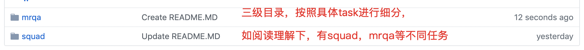

# Paddle官方模型库开发规范

## 目录
- [**整体目标和原则**](#整体目标和原则)

- [**必选规范**](#必选规范)

  - [**目录结构**](#目录结构)
  
  - [**功能实现**](#功能实现)
  
  - [**命名规范**](#命名规范)
  
  - [**README**](#README)
  
  - [**多环境支持**](#多环境支持)
  
  - [**注释和Licenses**](#注释和Licenses)

- [**建议规范**](#建议规范)

  - [**工具包PALM**](#工具包PALM)
  
  - [**显存优化**](#显存优化)
  
- [**合入规则**](#合入规则)
  
  - [**代码提交**](#代码提交)
  
  - [**code_review**](#code_review)

- [**升级维护**](#升级维护)

## 整体目标和原则

### 整体目标
为PaddlePaddle/models用户，提供功能一致，风格统一，可插拔的NLP，CV，Speech等领域的重要模型。
提高PaddlePaddle用户的开发效率。
加速部分老旧有bug的API离场，并推进新API的快速落地。

### 原则
1. 不同领域在逻辑上统一功能，在具体落实上（如configure的使用方式），尊重并拥抱各个领域的主流做法。但在具体大方向上，不可进一步拆分，需形成统一。
2. 区分规范为必选和可选，原则上要求所有模型遵守必选规范，建议遵守可选规范。
3. 原则上要求模型可以在**GPU单卡多卡**，**CPU多核**上执行**训练**，**预测**，**评估**和**准备部署环境**，并可以支持轻松**使用自定义数据**。
4. 如果有特殊情况，需要在readme中的显眼位置做出说明，避免用户踩坑。

## 必选规范

### 目录结构

遵照1.5 Paddle-models结构，将整体模型库拆分为3级目录结构，如下图所示：

#### 一级目录，按照大方向进行细分，如PaddleNLP，PaddleCV等：

#### 二级目录，按照具体场景进行拆分，如在PaddleNLP下，有neural_machine_translation，reading_comprehension等：

#### 三级目录，按照具体任务进行拆分，如在reading_comprehension下，有squad任务，mrqa任务等：

## 建议规范

